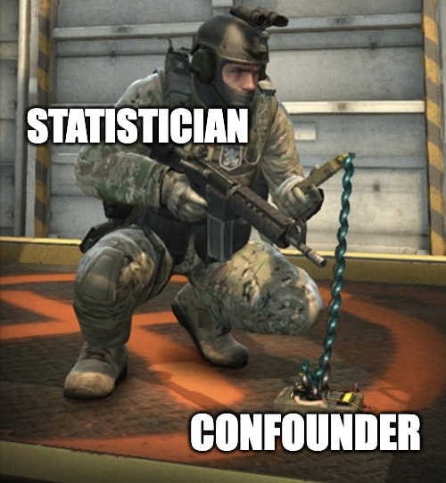

# Nonlinear Causal Discovery with Confounders 

This repository contains an implementation of the following paper 

- Li, C., Shen, X., & Pan, W. (2022+). Nonlinear causal discovery with confounders. Submitted.

The method is named **De**confounded **Fu**nctional **S**tructure **E**stimation (DeFuSE).




A brief introduction to DeFuSE.


## Contents

### DeFuSE code

### Simulations


### Real Data


## Preliminaries

### DeFuSE as a standalone Python package


### Python requirements for simulation

conda environment file 


The Python code is tested on a server with specs:


### R requirements for simulation

You need to install R packages `bnlearn`, `CAM`, `lrpsadmm`, and `pcalg`.

The R code is tested on an Apple M1 Mac 2020 with specs:


## Usage


or you can try quick examples 

roughly 1 hrs to complete


For complete simulations, 


NOTE: the complete simulations will take more than 100 hrs to complete.


## Citing information

If you find the code useful, please consider citing 
```

```


The code is maintained in github

This project is in development -- the ultimate goal is to 

Implementing the structure learning algorithms is error-prone. 
If you spot any error, please file an issue [here]() or contact me via [email]() -- 
I will be grateful to be informed.

## References

[1] Frot, B., Nandy, P., & Maathuis, M. H.  (2019).
[Robust causal structure learning with some hidden variables](https://rss.onlinelibrary.wiley.com/doi/full/10.1111/rssb.12315), JRSSB. 
Open-sourced softwares: LRpS+GES is implemented by [lrpsadmm](https://github.com/benjaminfrot/lrpsadmm) and [pcalg](https://github.com/cran/pcalg).

[2] Zheng, X., Dan, C., Aragam, B., Ravikumar, P., & Xing, E. P. (2020). 
[Learning sparse nonparametric DAGs](https://proceedings.mlr.press/v108/zheng20a), AISTATS 2020. 
Open-sourced software: [NOTEARS](https://github.com/xunzheng/notears).

[3] Bühlmann, P., Peters, J., & Ernest, J. (2014).
[CAM: Causal additive models, high-dimensional order search and penalized regression](https://projecteuclid.org/journals/annals-of-statistics/volume-42/issue-6/CAM--Causal-additive-models-high-dimensional-order-search-and/10.1214/14-AOS1260.full), 
AOS. 
Open-sourced software: [CAM](https://github.com/cran/CAM).

[4] Colombo, D., Maathuis, M. H., Kalisch, M., & Richardson, T. S. (2012).
[Learning high-dimensional directed acyclic graphs with latent and selection variables](https://projecteuclid.org/journals/annals-of-statistics/volume-40/issue-1/Learning-high-dimensional-directed-acyclic-graphs-with-latent-and-selection/10.1214/11-AOS940.full), AOS. 
Open-sourced software: RFCI is implemented by [pcalg](https://github.com/cran/pcalg).

[5] Kalisch, M., Mächler, M., Colombo, D., Maathuis, M. H., & Bühlmann, P. (2012).
[Causal Inference Using Graphical Models with the R Package pcalg](https://www.jstatsoft.org/article/view/v047i11), JSS. 
Open-sourced software: [pcalg](https://github.com/cran/pcalg).

In addition, part of the simulation code is adapted from 
[Frot's code](https://github.com/benjaminfrot/lrpsadmm-examples)
and 
[Zheng's code](https://github.com/xunzheng/notears).

I would like to thank the authors of above open-sourced softwares.

